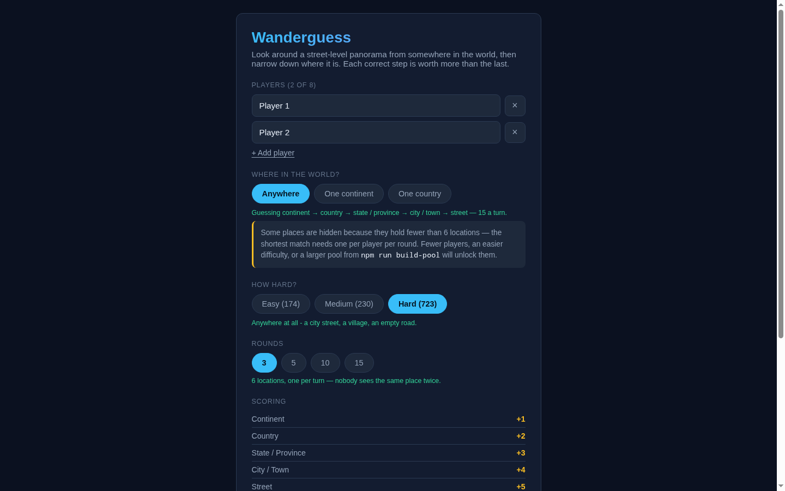

<p align="center">
  
</p>

# Wanderguess

<!-- BADGES:START -->


[](LICENSE.md)
[](CONTRIBUTING.md)
<!-- BADGES:END -->

## Table of Contents

- [Description](#description)
- [Screenshots](#screenshots)
- [Features](#features)
- [Requirements](#requirements)
- [Installation](#installation)
- [Usage](#usage)
  - [Rules](#rules)
  - [Narrowing the world](#narrowing-the-world)
  - [Difficulty](#difficulty)
  - [Auto-pan](#auto-pan)
  - [Commands](#commands)
  - [Rebuilding the location pool](#rebuilding-the-location-pool)
- [Architecture](#architecture)
  - [Where the data comes from](#where-the-data-comes-from)
  - [How the location pool is built](#how-the-location-pool-is-built)
  - [The street tier](#the-street-tier)
  - [The landmark index](#the-landmark-index)
  - [Deployment](#deployment)
- [Credits](#credits)
- [Contributing](#contributing)
- [License](#license)

## Description

A party game for 1–8 players. Each turn drops you into a 360° street-level
panorama somewhere in the world. Look around, then narrow down where you are:
continent, then country, then state or province, then city, and finally the
street itself.

**Play it at [wanderguess.geoffmyers.com](https://wanderguess.geoffmyers.com).**

It follows an earlier two-player photo-guessing game, with five scoring tiers
instead of three, any number of players from one to eight, and imagery from
Mapillary's public street-level collection instead of your own photo library.

## Screenshots

<p align="center">
  
</p>

<p align="center"><em>Match setup. Scope, difficulty and round count all change the pool, and the
scoring ladder shows what each tier is worth.</em></p>

## Features

- **1–8 players** taking turns on one screen, or solo play
- **A 360° panorama viewer** written directly in WebGL: drag to look around,
  scroll to zoom
- **Five tiers per turn**, from continent to street, worth up to 15 points
- **723 locations** in 76 countries on six continents, with place names in
  English and street names in the local language
- **World, continent or country matches**, with the tiers a scope gives away
  removed
- **Three difficulties**: world-famous landmarks, big cities, or anywhere at all
- **Matches of 3, 5, 10 or 15 rounds**, where everyone gets the same number of
  turns
- **Auto-pan** that sweeps the view on its own, and respects your system's
  reduced-motion setting
- **Resume after a refresh**: a match in progress survives a page reload
- **Credit for every photographer**, shown on each panorama as the imagery
  licence requires
- **No server and no billing account**: a static site built only on free,
  open data sources

## Requirements

- **Node.js 20.9** or newer (required by Next.js 16) and npm
- A free **Mapillary client token** from the
  [Mapillary developer dashboard](https://www.mapillary.com/dashboard/developers).
  The browser uses it to load the panoramas. No billing account is needed.
- A browser with **WebGL** for the 360° viewer. Without it the game falls back
  to a flat image, which still plays but is not the intended experience.
- To rebuild the location pool: a contact address to send to Nominatim and
  Wikidata, as their usage policies require, and patience, since a full rebuild
  takes well over half an hour at Nominatim's one request per second

## Installation

```bash
git clone https://github.com/geoffmyers/wanderguess.git
cd wanderguess
npm install
cp .env.example .env
```

Edit `.env` and set your token:

```bash
NEXT_PUBLIC_MAPILLARY_TOKEN=<your-client-token>   # used by the browser
MAPILLARY_TOKEN=<your-client-token>               # used by the pool builder; can be the same
NOMINATIM_CONTACT=<your-email-or-url>             # only for rebuilding the pool
```

Then start the development server:

```bash
npm run dev
```

Open [http://localhost:3000](http://localhost:3000). The location pool,
`public/data/locations.json`, is included, so the game is playable straight
away. Without a pool the game shows a "No locations yet" screen explaining how
to build one.

## Usage

### Rules

| Tier | Points | Running total |
|---|---|---|
| Continent | 1 | 1 |
| Country | 2 | 3 |
| State / Province | 3 | 6 |
| City / Town | 4 | 10 |
| Street | 5 | 15 |

Each correct answer banks the running total and unlocks the next tier. A wrong
answer ends the turn but keeps everything banked so far, so pushing on for the
street is a real gamble.

The street tier is the one the 360° viewer was built for. Every other tier is
*reasoned out*, from architecture, vegetation or which side of the road the cars
drive on. The street can be **solved**, by looking around for a sign. It turns
the panorama from evidence into a puzzle with the answer hidden somewhere in it.

A match runs a fixed number of rounds (3, 5, 10 or 15). Every player takes
exactly one turn per round on a different location, so turn order confers no
advantage and no tie-breaker rules are needed. The highest total wins, and equal
totals share the win. Solo play is the same loop, scored out of `15 × rounds`.

### Narrowing the world

A match can be restricted to one continent or one country, chosen at setup.
Narrowing also **removes the tiers it gives away**: in a Europe match nobody
guesses the continent, and in a United States match nobody guesses the country
either. Asking anyway would hand out free points every turn.

| Scope | Tiers in play | Perfect turn |
|---|---|---|
| Anywhere | continent → country → region → city → street | 15 |
| One continent | country → region → city → street | 14 |
| One country | region → city → street | 12 |

Scores are therefore not comparable between scopes, which does not matter:
every player in a match plays the same one. Only continents and countries the
pool can actually fill a match from are offered, and the setup screen says why
one is unavailable rather than hiding it.

### Difficulty

Chosen at setup alongside the scope, and independent of it.

| Mode | Pool |
|---|---|
| **Easy** | A world-famous landmark stands within its own visibility radius, and the round **opens facing it** |
| **Medium** | A major city (250,000+ people), with no landmark anywhere near |
| **Hard** | Everything: a city street, a village, an empty road |

Hard is deliberately *unfiltered* rather than "the leftovers". The mode means
"anywhere, significant or not", which includes the landmarks, and treating the
three modes as a partition would make Hard a smaller pool than the game had
before difficulty existed.

Scoring is the same in every mode. Difficulty is a match setting like scope, so
scores are comparable within a match and meaningless across modes. Paying fewer
points for Easy would only make the ladder harder to reason about.

Because the two filters are independent, either can empty the pool on its own,
and the combination can empty it when neither is unreasonable alone; Easy plus
South America is the obvious case. The setup screen names **which** filter is
responsible, because "not enough locations" with no culprit reads as a bug.

**Easy mode does not trust proximity.** Standing 200 m from the Eiffel Tower
says nothing about whether it is in the picture, since a building can hide it
entirely. Two things close most of that gap:

- **A visibility radius per kind of landmark**, not one number. A 300 m tower
  reads from a kilometre away, while a fountain has to be almost in front of
  you. `radiusM` in `config/landmark-config.json` sets it per Wikidata class.
- **The round opens facing the landmark.** The bearing from panorama to landmark
  is computed when the pool is built and stored in the manifest as `initialYaw`,
  so the landmark is already in frame.

An occluded landmark can still slip through. That is the accepted cost of a
build-time pipeline with no vision model in it.

### Auto-pan

A play/pause button on the viewer sweeps the view through a full 360° once a
minute, so a player can take in the whole panorama without dragging. The speed
is `viewer.autoPanDegreesPerSecond` in `config/game-config.json`.

It is **on by default**, so a round starts by showing you around. Any click,
touch, drag or scroll hands control straight back, and pausing it carries over
to the next round. A visitor whose system asks for **reduced motion** does not
get it automatically but can still press play; set
`viewer.respectsReducedMotion` to `false` to override that.

### Commands

```bash
npm run dev          # development server
npm run build        # static export to out/
npm test             # Vitest over the game logic
npm run typecheck    # tsc --noEmit
npm run deploy       # build, then wrangler deploy (see Deployment)
```

### Rebuilding the location pool

`npm run build-pool` regenerates `public/data/locations.json`. It is run
occasionally by hand, not on every deploy.

```bash
npm run build-pool                         # every pass, resuming from the cache
npm run build-pool -- --pass landmarks     # one pass
npm run build-pool -- --pass cities,rural  # several passes
npm run build-pool -- --pass streets       # enrich what the others found
npm run build-pool -- --force              # ignore the cache and start over
npm run build-pool -- --limit 50           # a small pool for a smoke test
npm run build-pool -- --emit-only          # write the manifest from the cache, no network
```

The builder caches to `scripts/.pool-cache.json` **after every accepted
location**, so an interrupted run loses at most one candidate. The manifest is
only written at the end, which is what `--emit-only` is for: it recovers a
hand-stopped run, and it is also how a classification change reaches an
existing pool, since difficulty is decided when the manifest is written.

Tuning lives in `config/pool-config.json` and `config/landmark-config.json`; the
scripts contain no values of their own.

## Architecture

```
config/            game rules, pipeline tuning, ISO → continent lookup
scripts/           the location-pool and landmark builders, and diagnostics
public/data/       the generated location manifest
lib/game/          scoring, turn order, pool selection, the Zustand store
lib/viewer/        the WebGL equirectangular panorama renderer
lib/mapillary/     image URL resolution at play time
app/components/    the UI
```

Game rules live in `config/game-config.json`, never as literals in source. The
panorama viewer is a few hundred lines of WebGL that inverts the equirectangular
projection in a fragment shader, with no three.js.

Turn order derives from a single, ever-increasing `turnIndex`; the current
player and round fall out of arithmetic, which is why any number of players
needs no special cases.

Because this is a static export, the manifest is publicly readable, and a
determined player could read answers from the developer tools. That is
accepted: obfuscation would not actually prevent it, and this is a party game.

See [ARCHITECTURE.md](ARCHITECTURE.md) for more detail.

### Where the data comes from

**Imagery: the [Mapillary](https://www.mapillary.com) API v4.** Free, no billing
account, actively maintained. Google's Street View Static API was rejected
because it requires a credit card on file even inside its free tier, and its
terms forbid caching imagery.

**Place names and distractors: [GeoNames](https://www.geonames.org/)**
(`cities15000`, `admin1CodesASCII`, `countryInfo`).

**Verification and street names: [Nominatim](https://nominatim.openstreetmap.org/)**,
at its required one request per second, to confirm each panorama really is
where the seed city says it is, and to name the road it stands on.

**Street distractors: the [Overpass API](https://overpass-api.de/)**
(OpenStreetMap), the only free source of street geometry; GeoNames has none.

**Landmarks: [Wikidata](https://www.wikidata.org)**, queried through the public
SPARQL endpoint and ranked by sitelink count. An item carried by 40 or more
language editions of Wikipedia is world-famous by construction, so nobody has
to curate a list by hand.

### How the location pool is built

`scripts/build-location-pool.mjs` runs four passes:

| Pass | Seeds on | Exists because |
|---|---|---|
| `cities` | GeoNames cities in a region's bounding box | the original pass, with a high hit rate near settlements |
| `landmarks` | Wikidata landmark coordinates | panoramas beside world-famous landmarks are a vanishing fraction of Mapillary, so *filtering* for them returns almost nothing |
| `rural` | random points on the Mapillary coverage graph | a city-seeded pool cannot contain a rural road, so "anywhere" was a promise the pool could not keep |
| `streets` | *(enriches what the others found)* | the street tier needs a named road and four named neighbours, from two services the other passes do not use |

The rural pass is the interesting one. Sampling random points over a region
does not work, because coverage follows roads and nearly every random point has
nothing near it. But Mapillary's coverage tiles carry a **`sequence` layer at
every zoom from 6 to 14**, and a sequence line *is* a statement that imagery
exists there. So the pass samples a random zoom-8 tile (about 150 km across,
with thousands of sequences), picks a panoramic sequence inside it, and
resolves that to a real image with one API call. Out in the country, the
honest city answer is the nearest town, but only when it is *unambiguously*
nearest: if a second town lies within 1.6× the distance, the location is
dropped rather than shipped as a coin flip.

Each location then goes through the same steps:

1. **Seed.** Pick a starting point for the pass.
2. **Find.** Read the Mapillary **coverage tile** containing it and take every
   image flagged `is_pano`, newer than the cutoff year and within
   `maxCityDistanceKm` of the seed. Tiles beat querying `/images?bbox=` by an
   order of magnitude: one zoom-14 tile over central Amsterdam returns 63,837
   images, 15,723 of them panoramas, in a single request, where the best
   bounding-box query managed 263 before the server refused on data volume.
3. **Verify.** Reverse-geocode through Nominatim, and reject a candidate that
   crossed a border, landed in a different region from its seed, or lies too far
   from the seed city.
4. **Bake distractors.** Four wrong answers per tier, drawn from *real siblings*
   of the answer: other countries on the same continent, other regions in the
   same country, other cities in the same region. Drawing them from the pool
   would produce giveaway rounds like "Japan vs Brazil, Iceland, Kenya".
5. **Classify.** Give each location a difficulty from where it stands, not from
   which pass found it. A city-pass panorama under the Colosseum *is* an easy
   location. Easy locations also get their landmark name and the bearing to it.
6. **Emit** `public/data/locations.json`, sorted by image ID so that a rebuild's
   diff shows only the locations that changed.

The coverage tile has no photographer's username, which attribution needs, so
exactly one extra API call follows each *accepted* location and none follows a
rejected one.

If you switch to the older `discoveryMode: "bbox"`, note two things Mapillary's
documentation gets wrong: `camera_type` can also be **`spherical`**, the more
common of the two 360° values; and **`camera_type=` as a query parameter is
silently ignored**. `is_pano=true` is the filter that works.

Use `computed_compass_angle`, never the raw `compass_angle`, for bearings. The
raw value is the device heading and is often a stand-in `0.0`, indistinguishable
from a camera genuinely facing north: the Arc de Triomphe panorama reports
`0.0` against a computed `134.9°`, so a round built from it opened 121° away from
an arch that was dead ahead. A location with no computed heading gets no bearing
at all, because opening straight ahead is a smaller failure than opening
confidently the wrong way.

### The street tier

The `streets` pass uses two services with opposite access patterns:

- **The answer** comes from a **second** Nominatim call at zoom 18. The
  verification call runs at zoom 12 and returns no `road` at all, and raising its
  zoom would change which address fields come back and quietly re-tune the city
  answers.
- **The distractors** come from Overpass, batched **a dozen locations per
  query**. A per-location `way(around:250,…)` took 22 seconds where the
  equivalent bounding box took 0.35, and one request per location got this
  project's IP blocked before 5% of a sweep was done. About 1,090 requests became
  about 45.

The street lookup deliberately sends **no** `Accept-Language`, unlike the
verification call, which asks for English to match GeoNames. With English,
Nominatim answers with a road's `name:en` while Overpass answers with its local
`name`, and a Kyiv round once offered `Kyyevo-Myrotska Street` as the answer
with `Києво-Мироцька вулиця` among the distractors: the same street twice. The
local name is also simply correct here, since this is the tier you solve by
reading a street sign.

**A location with no named road is dropped**, along with one whose
neighbourhood cannot supply four other named streets. A turn capped at 10 while
the next player's is worth 15 would be unfair to whoever was unlucky in the
deal.

### The landmark index

`scripts/build-landmark-index.mjs` writes `scripts/.landmarks.json` from
Wikidata, and the pool builder creates it automatically if it is missing.

- **One query per class, never a broad root.** "Architectural structure" is
  millions of items and times out the public query service every time, while the
  same query for "tower" returns in about a second.
  `scripts/probe-wikidata-classes.mjs` checks a candidate class before you add
  it.
- **Narrow classes are not enough.** "Archaeological site" brings in Pompeii,
  and also Athens, Cairo, Damascus, Cologne and Alexandria: whole cities, each
  with a coordinate at its centre. A second pass drops anything that is also a
  "human settlement". Broader exclusions such as "administrative territorial
  entity" looked reasonable and quietly removed the Eiffel Tower, Big Ben and the
  Statue of Liberty too.

### Deployment

The live site is a Next.js static export served by a Cloudflare Worker with
static assets (`[assets] directory = "out"` in `wrangler.toml`), at
`wanderguess.geoffmyers.com`. To deploy your own copy, change `account_id` and
the `routes` entry in `wrangler.toml`, then run `npm run deploy`.

`NEXT_PUBLIC_MAPILLARY_TOKEN` ends up in the browser bundle by design. It is the
same kind of public client token that MapillaryJS uses.

## Credits

Attribution here is **licence compliance, not decoration**, and the in-game
attribution bar must stay visible.

- Street-level imagery from [Mapillary](https://www.mapillary.com/), licensed
  **CC BY-SA 4.0**. Every panorama credits its contributor by username, linked
  to their profile, with the licence named and linked. Mapillary's
  [Terms of Use](https://www.mapillary.com/terms) (§11) separately require
  visibly displaying the Mapillary logo plus a link back to Mapillary, both for
  images and for data extracted through the API — this game does both. The
  contributor credit, licence link and homepage link are implemented in
  `AttributionBar`; the logo itself is not (see the known gap below).
- Place names, streets and boundaries from
  [OpenStreetMap](https://www.openstreetmap.org/copyright) through Nominatim and
  Overpass, licensed **ODbL**.
- Populated-place data from [GeoNames](https://www.geonames.org/), licensed
  **CC BY 4.0**.
- Landmark data from [Wikidata](https://www.wikidata.org/), released under
  **CC0**.
- The README icon is the [Font Awesome](https://fontawesome.com/) `street-view` glyph,
  as shown for this app on [geoffmyers.com](https://www.geoffmyers.com), used under
  [CC BY 4.0](https://creativecommons.org/licenses/by/4.0/).
- Built with [Next.js](https://nextjs.org/), [React](https://react.dev/),
  [Zustand](https://zustand.docs.pmnd.rs/) and
  [Vitest](https://vitest.dev/).

> **Known gap:** Mapillary's Terms of Use require displaying its actual logo
> mark, not just a text link, and this repo does not embed one — the
> attribution bar renders "Mapillary" as a text wordmark instead. That is a
> deliberate choice, not an oversight: Mapillary's press kit gates the real
> logo files behind its brand guidelines, and shipping a homemade lookalike
> would misrepresent the mark worse than a plain text link does. Closing this
> gap means downloading the official asset from Mapillary's press kit under
> its stated terms and adding it to `public/`, which needs a licensing call
> this repository's automation does not make on its own.

Written by Geoff Myers.

## Contributing

Bug reports and pull requests are welcome. See [CONTRIBUTING.md](CONTRIBUTING.md)
for setup, checks and how this repository is published.

## License

This program is free software: you can redistribute it and/or modify it under
the terms of the GNU General Public License as published by the Free Software
Foundation, either version 3 of the License, or (at your option) any later
version.

This program is distributed in the hope that it will be useful, but WITHOUT ANY
WARRANTY; without even the implied warranty of MERCHANTABILITY or FITNESS FOR A
PARTICULAR PURPOSE. See [LICENSE.md](LICENSE.md) for the full text of the GNU
General Public License.

SPDX-License-Identifier: `GPL-3.0-or-later`
